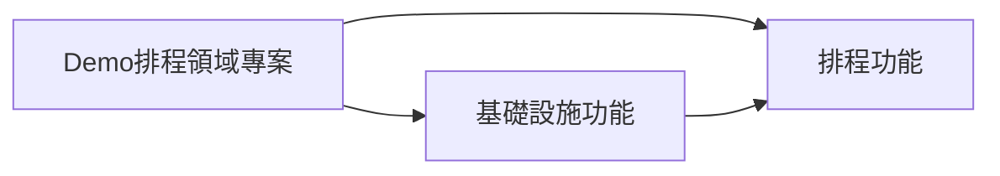

# 排程處理解決方案

> Demo產品排程處理解決方案，提供排程相關功能的實作，包括排程管理、排程執行等。

## 更新記錄

| 日期 | 作者 | 調整內容 | 版本 |
| ---------- | -------- | --------------------------------- | -------- |
| 2025.08.20 | Jason Tsai | 首版 | 1.0.0 |

## 方案資訊

| 項目 | 資訊規格 |
| ---- | ------- |
| Solution Name | Scheduler |

## 專案架構(Architecture)

| 專案名稱 | 專案描述 | 版本 |
| ------- | -------- | ---- |
| Scheduler | Demo產品服務，主要處理排程相關功能 | 版本 |
| Scheduler.Infrastructure | Demo產品服務，主要處理基礎設施相關功能 | 版本 |
| Scheduler.Domain | Demo產品服務，主要處理領域相關功能 | 版本 |

## 檔案相依性

* Base.Infrastructure.Interface
* Base.Infrastructure.Toolkits
* Base.Authentication
* Base.Mail
* Base.Security

## 基礎服務專案(Base Service Project)

| 服務名稱 | 服務描述 | 版本 |
| ------- | -------- | ---- |
| Base.Authentication | Demo產品服務，主要處理 Authentication 服務 | 版本 |
| Base.Mail | Demo產品服務，主要處理 Mail 服務 | 版本 |
| Base.Security | Demo產品服務，主要處理 Security 服務 | 版本 |



## 其他說明

本專案遵循微服務架構，並使用 Domain-Driven Design (DDD) 的方法論進行設計與實作。各個服務之間透過 API 進行通訊，並使用事件驅動架構來實現非同步處理。

### 新增排程

使用以下範例程式碼來新增排程：

```csharp
public static class SchedulerEndpoint
{
    private static void MapSchedulerEndpoint(this IEndpointRouteBuilder app)
    {
        // Map Quartz scheduler with group endpoints
        RouteGroupBuilder schedulerGGroup = app.MapGroup("/scheduler/{group}")
            .WithTags("SchedulerGroup")
            .WithDescription("Endpoints for managing Quartz jobs and triggers");

        _ = schedulerGGroup.MapPost("/jobs/notified", async (ISchedulerFactory schedulerFactory, string group, string message, CancellationToken token) =>
        {
            IScheduler scheduler = await schedulerFactory.GetScheduler(token);
            IJobDetail jobDetail = JobBuilder.Create<MailJob>()
                .WithIdentity("MailJob", group)
                .UsingJobData("Message", message)   
                .Build();

            ITrigger trigger = TriggerBuilder.Create()
                .WithIdentity("MailJobTrigger", group)
                .StartNow()
                .WithCronSchedule("0/5 * * * * ?") // Every 5 seconds
                .Build();

            _ = await scheduler.ScheduleJob(jobDetail, trigger, token);
            Log.Information($"NotifiedJob has been scheduled with message: {message}");
            return Results.Ok($"NotifiedJob has been scheduled with message: {message}");
        }).WithSummary("Schedule a NotifiedJob with a message")
            .WithDescription("Schedules a NotifiedJob that logs a message every 5 seconds.");
    }
}
```

使用以下方法建立基礎排程工作：

```csharp
public static class DefaultJobExtension
{
    public static void UseDefaultBackgroundJobStore(this IServiceCollectionQuartzConfigurator configurator)
    {
        configurator.AddJob<MailJob>(opts => opts.WithIdentity(MailJob.JobKey).StoreDurably())
            .AddTrigger(opts => opts
                .ForJob(MailJob.JobKey)
                .WithIdentity($"{MailJob.JobKey.Name}.trigger")
                .StartAt(DateTimeOffset.UtcNow.AddSeconds(30)) // 30 seconds later
                .WithCronSchedule("0 * * * * ?")); // every hour
    }

}
```
